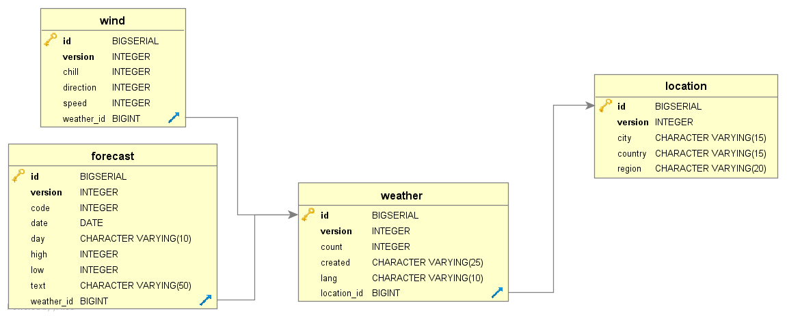

Погодный брокер: получение сообщений из JMS-очереди и формирование таблиц БД (часть 2)
=======================
Деплой на сервер приложения описан [здесь](https://github.com/goryacms/weather_queue/blob/master/README.md)

PostgreSQL 
 - 
В качестве СУБД используется [PostgreSQL](https://postgrespro.ru/windows)

Структура БД имеет следующий вид:

Т.к. в location используется автоинкрементный суррогатный ключ, 
уникальность гарантирует  unique index на полях city и country.

Распределённая транзакция 
 -
На сервере приложения зайти в менеджер управления ( http://localhost:9990 ) , далее Configuration -> Subsystems -> Datasources -> XA.
Сформировать новый DataSource. Основные параметры:

Attributes
 - JNDI:
   java:jboss/PostgresXADS
 - Driver:
    postgresql-42.2.2.jar
    
Properties
 - DatabaseName:
   postgres (название БД)
 - PortNumber:
   5432
 - ServerName:
   localhost

Альтернативный вариант настройки параметров - внести изменения в файл standalone.xml в каталоге configuration. 
Либо настраивать с помощью jboss-cli.bat (.sh для Linux) из каталога bin.
   
Для работы распределённой транзакции может потребоваться изменить файл конфигурации Postgre. 
Для этого необходимо найти в папке с установленным Postgre каталог data. В нём изменить файл 
postgresql.conf : установить значение max_prepared_transactions больше нуля (обычно это значение равно max_connections). 
Сохранить изменения и перезапустить сервер.   